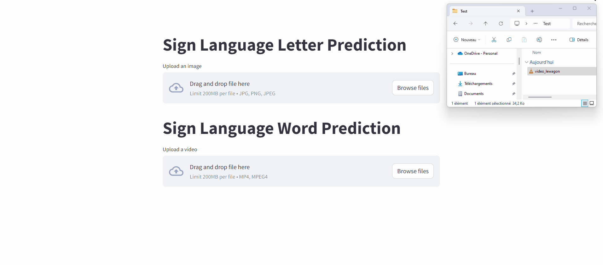

# Sign-Sense Project : *American Sign Language Image Classification*

This project aims to develop a model for classifying American Sign Language (ASL) images into English. The goal is to create a tool that can recognize ASL signs from images and translate them into English.

## Project Description

Sign language is an essential means of communication for people who are deaf or hard of hearing. However, there is a communication barrier between people who use sign language and those who do not. This project aims to reduce this barrier by developing a model that can recognize ASL signs and translate them into English.

The project uses a labeled dataset of ASL images to train an image classification model. The model is based on a Convolutional Neural Network (CNN) and is trained using the TensorFlow library.

## Features

- Use of a Convolutional Neural Network (CNN) for classification
- Transfer Learning (YOLOv8)
- Training of the model on a labeled dataset
- Evaluation of the model on a test dataset
- Streamlit API

## Installation

To install the project, you need to clone this GitHub repository and install the required dependencies. The dependencies are listed in the `requirements.txt` file. You can install the dependencies using pip:
`pip install -r requirements.txt`

## Dataset

You can download the Kaggle dataset on this link : https://www.kaggle.com/datasets/grassknoted/asl-alphabet/data

## Usage

The project's API was deployed on the cloud in March 2024 and is not currently available for use. Here's a quick look at what it looked like :

